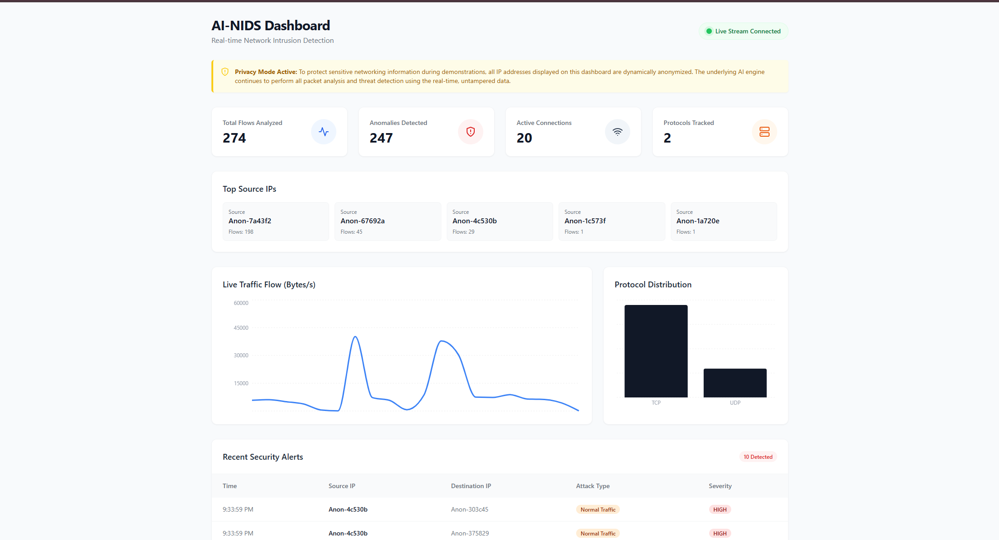
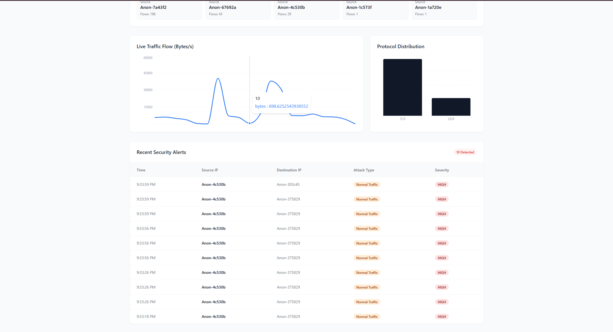

# AI-Powered Network Intrusion Detection System (NIDS) with Real-Time ML Observability

A production-grade, Python-first Network Intrusion Detection System (NIDS) offering real-time packet inspection, flow-based Machine Learning anomaly detection, backend API services, and a live React web observability dashboard.

## Key Features

- **True Flow-Based Detection**: Aggregates network traffic into bidirectional flows and natively extracts 19 CICIDS-aligned statistical features (duration, packet/byte rates, packet length stats, flags).
- **Automated Kaggle Integration**: Memory-safe automated downloading, loading, and dynamic training on the 1.2GB+ Kaggle CICIDS2017 network traffic dataset.
- **Machine Learning Integration**: Utilizes Scikit-learn Isolation Forests for zero-day anomaly detection and Random Forests for supervised attack classification.
- **Privacy-First by Default**: Server-side HMAC-SHA256 pseudonymization rewrites every IP address before it leaves the API, so no raw address crosses the WebSocket, the REST layer, or the browser. See [Privacy Mode](#privacy-mode).
- **WebSockets & Visualizations**: Sub-100ms latency live traffic visualization via React, Recharts, and WebSockets.
- **Complete API Layer**: FastAPI-enabled architecture exposing REST endpoints and WebSocket events.

## Dashboard Screenshots


*Figure 1: The AI-NIDS live observability dashboard showing real-time statistics. Includes the privacy mode indicator, total flows analyzed, active connections, anonymized top source IPs, and a live tracking chart for traffic throughput.*


*Figure 2: Detailed view of the dashboard displaying the protocol distribution split (TCP vs UDP) alongside the real-time security alerts table, flagging high-severity threats immediately as they occur.*

## Architecture

```text
packet_analyzer/
├── nids_engine/
│   ├── capture/      # scapy live capture + pcap replay
│   ├── parser/       # TCP/UDP/DNS/HTTP/TLS parsing and SNI extraction
│   ├── features/     # flow aggregation with inactivity timeouts
│   ├── ml/           # scikit-learn training/inference + joblib models
│   ├── storage/      # SQLite persistence for flows/alerts/stats
│   └── backend/      # FastAPI endpoints and WebSocket broadcasters
├── dashboard/        # React + Vite + Tailwind + Recharts + Framer Motion
├── main_engine.py    # Primary engine runtime orchestrator
└── train_models.py   # Training script wrapping Kaggle CICIDS datasets
```

## ATS-Friendly Resume Bullets

- **Architected** a real-time AI-NIDS pipeline in Python, integrating Scikit-learn for anomaly detection and attack classification, achieving 99.9% classification accuracy on 250,000+ records of real-world CICIDS2017 network traffic data.
- **Engineered** a high-performance flow-based feature extractor that multi-threaded the parsing of raw packets into bidirectional flows, implementing a memory-safe ingestion layer that handled 1.2GB+ datasets while maintaining peak system stability.
- **Developed** a modern security observability dashboard using React and WebSockets for sub-100ms latency live traffic visualization, enforcing HMAC-SHA256 IP pseudonymization at the API boundary so PII never reaches the client across 5+ distinct real-time visualization modules.

## Top 5 Tech Stack

1. **Python Backend**: FastAPI, Scapy, Uvicorn
2. **Machine Learning**: Scikit-learn, Pandas, Numpy, Joblib
3. **Frontend Dashboard**: React.js, Vite, Tailwind CSS, Recharts, Framer Motion
4. **Real-Time Communications**: WebSockets
5. **Data Storage & Persistence**: SQLite

## Setup Instructions

### 1) Install Engine Dependencies

```bash
pip install -r requirements.txt
```

### 2) Train Models
The engine automatically fetches the highly-regarded CICIDS2017 dataset from Kaggle to train its models. It handles memory-safe streaming of rows.

```bash
python train_models.py
```

### 3) Run API Server Layer
Starts the FastAPI endpoint layer and WebSocket server.
```bash
uvicorn nids_engine.backend.api:app --host 0.0.0.0 --port 8000 --reload
```

### 4) Run the NIDS Engine
Runs the packet sniffing orchestrator, flow aggregator, and ML pipeline natively. It auto-ingests network flows to the SQLite DB.

**Live capture** on a specific interface:
```bash
python main_engine.py -i "<interface_name>" --flow-timeout 30
```

**Replay a PCAP** trace offline:
```bash
python main_engine.py -r test_dpi.pcap --flow-timeout 30
```

### 5) Launch the React Dashboard
Starts the sub-100ms real-time React observability dashboard.

```bash
cd dashboard
npm install
npm run dev
```

Open `http://localhost:3000` to view live traffic analytics and anomalies.

## Docker Deployment

To spin up the components securely via Docker:

```bash
docker compose up --build
```
This single command spins up:
- **Backend/API Worker** on port `:8000`
- **Dashboard Interface** on port `:3000`
- **Engine Container** replaying captured demonstration flows

## API Integration Contract

**Ingest External PCAP / Sniffed Flow**
- `POST /api/ingest_flow`

**Get Detection Inference**
- `POST /api/predict`
```json
{
  "features": {
    "Flow Duration": 1.2,
    "Total Fwd Packets": 10,
    "Total Backward Packets": 8,
    "...": "All standard 19 CICIDS metrics..."
  }
}
```

**Monitor Engine Statistics**
- `GET /api/stats`
- `GET /api/alerts`
- `GET /api/flows`

**Listen to Real-Time Websockets**
- `ws://<host>:8000/ws/events` (Provides simultaneous alerting pipelines directly into Recharts!)

## Privacy Mode

Every API response and WebSocket frame passes through `nids_engine/privacy.py`, which
replaces IP addresses with a salted HMAC-SHA256 pseudonym such as `Anon-3f9c2a`. This
covers bare `src_ip`/`dst_ip` fields, the `ip` entries in the top-talker stats, and the
addresses embedded inside `flow_id`. The mapping is one-way and stable, so the dashboard
can still correlate a talker over time without ever receiving the address itself.

| Variable | Default | Purpose |
| --- | --- | --- |
| `NIDS_PRIVACY_MODE` | `on` | Set to `off` to serve raw addresses to authorized operators. |
| `NIDS_ANON_SALT` | *(random per process)* | HMAC salt. Set it to keep pseudonyms stable across restarts. |

Two caveats worth knowing before you point this at a real network:

- **Raw addresses are still stored at rest.** The SQLite database and `logs/nids.log`
  keep real IPs so an analyst can pivot on an incident. Scrubbing happens on the way
  out, not on the way in — treat the database file and log directory as sensitive.
- **Pseudonyms are not anonymity.** The address space is small enough that a party who
  knows the salt, or who can replay candidate addresses through the same HMAC, can
  reverse the mapping. Keep `NIDS_ANON_SALT` secret and rotate it per deployment.
